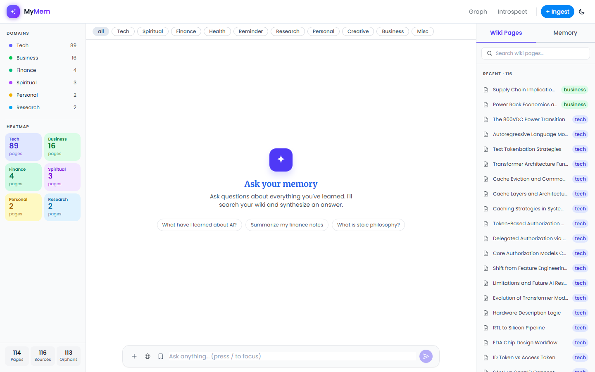
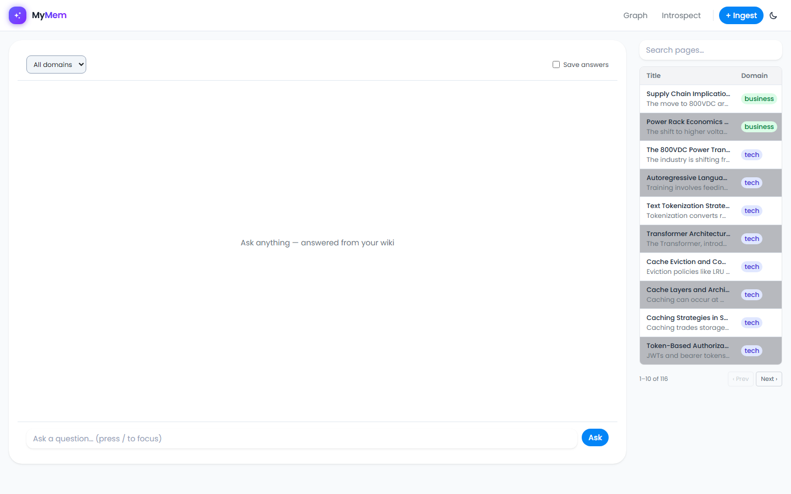
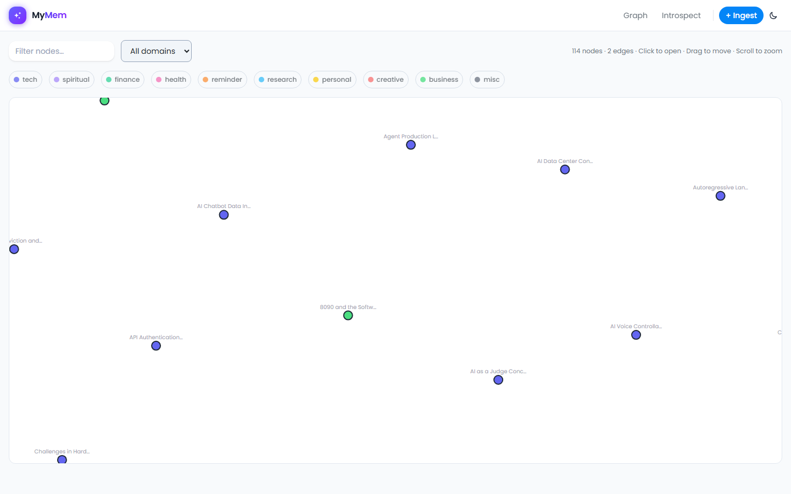
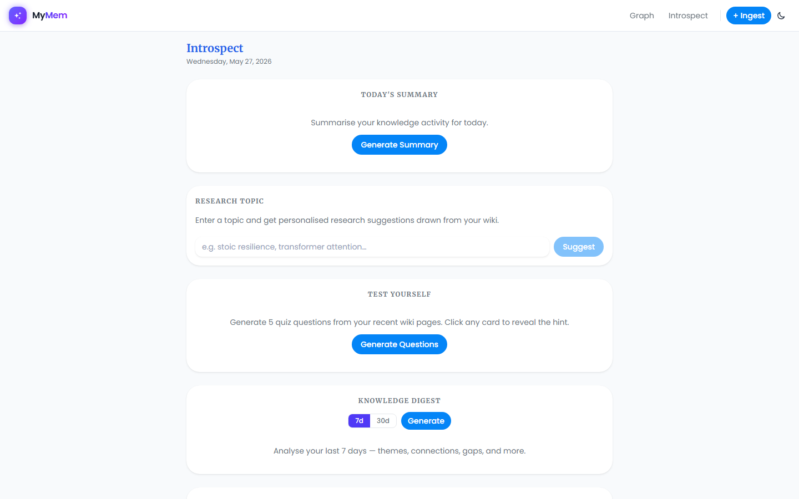
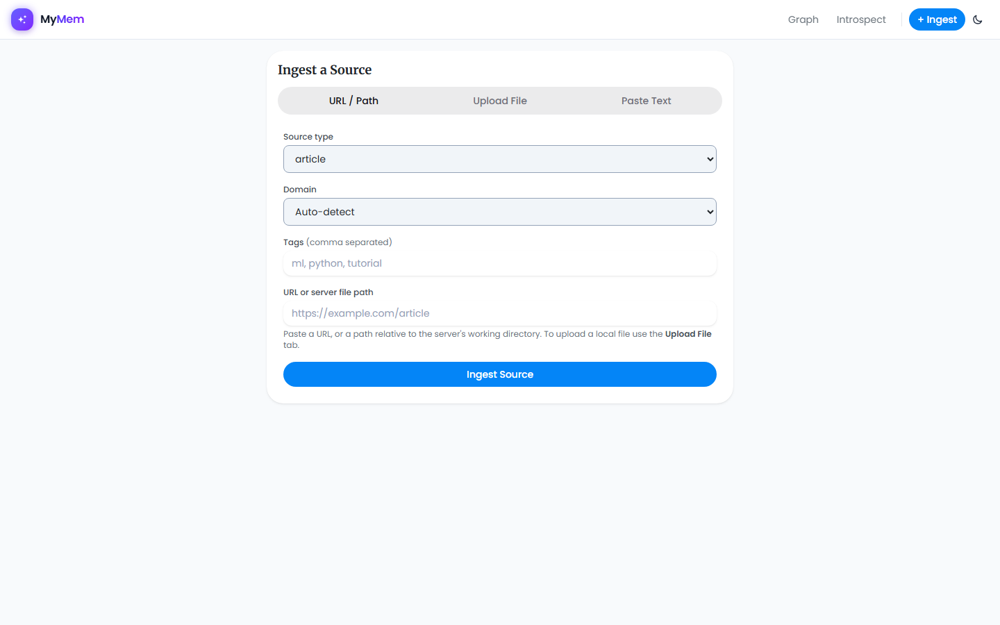

# MyMem

A personal LLM-powered wiki that **builds and maintains itself** from your sources.

Drop in articles, PDFs, YouTube videos, web pages, or raw notes — the LLM reads them, extracts knowledge, and writes interlinked markdown pages. Queries read the pre-built wiki instead of re-deriving answers every time.

---

## How it works

```
Sources (URLs, PDFs, YouTube, files)
        ↓  ingest
   LLM synthesises
        ↓
  Persistent wiki  ←→  Wikilink graph
  (markdown pages)
        ↓  query
  Hybrid search (BM25 + RAG vector)
        ↓
  LLM answer + citations
```

Unlike pure RAG tools that index raw chunks, MyMem **accumulates knowledge** — each source is compiled into structured wiki pages that grow and interlink over time.

---

## Screenshots

### Dashboard — chat interface with domain heatmap and wiki sidebar


### Search — Q&A answered from your wiki


### Knowledge Graph — D3 force-directed wikilink network


### Introspect — daily summary, quiz generator, knowledge digest


### Ingest — add any source (URL, file upload, paste text)


---

## Features

- **LLM wiki compiler** — sources compiled into interlinked markdown pages; knowledge accumulates over time
- **Hybrid retrieval** — BM25 keyword search + RAG vector search (sqlite-vec) combined at query time
- **Multi-LLM router** — Ollama (local, default), Anthropic, OpenAI with automatic fallback chain
- **Domain taxonomy** — pages tagged by domain (tech, finance, spiritual, health, personal, …) for filtered retrieval
- **Knowledge graph** — D3 force-directed wikilink network, filterable by domain
- **Introspect engine** — daily summary, research topic suggestions, quiz generator, knowledge digest
- **PDF support** — layout-aware chunking, RAG-only indexing for dense documents
- **Source types** — article, paper, repo, dataset, image, YouTube, podcast, tweet, webpage, book, note
- **Eval framework** — wiki quality, chunk ablation (HOPE score), self-supervised BM25 retrieval eval, RAGAS-lite LLM judge
- **Dark / light mode** — system preference detected, togglable

---

## Quick start

### Backend

```bash
# Install
pip install -e ".[dev]"

# (Optional) configure provider in config.yaml — defaults to local Ollama
# provider: anthropic   # or openai

# Start the server
mymem serve --port 7860
```

Opens at **http://localhost:7860**

### Frontend (dev mode)

```bash
cd frontend
npm install
npm run dev        # Vite dev server on :5173, proxies /api → :7860
```

### CLI

```bash
# Ingest a source
mymem ingest "https://example.com/article" --type article --domain tech

# Ingest a local PDF
mymem ingest raw/papers/attention.pdf --type paper --tags ml,attention

# Ingest a YouTube video
mymem ingest "https://youtu.be/VIDEO_ID" --type youtube --domain tech

# Ask a question
mymem query "What is the difference between self-attention and cross-attention?"

# Run the eval suite
mymem eval

# Lint the wiki (find orphans, broken wikilinks, stubs)
mymem lint

# Daily introspection
mymem introspect
```

---

## Stack

| Layer | Technology |
|---|---|
| Backend | Python 3.11+, FastAPI, Typer |
| LLM providers | Ollama (local), Anthropic, OpenAI |
| Vector store | sqlite-vec (embedded, no server) |
| Frontend | React 18 + TypeScript, Vite, Tailwind CSS v3 |
| Graph | D3.js v7 (force-directed) |
| Config | Pydantic Settings + config.yaml |
| Testing | pytest + pytest-asyncio (≥80% coverage) |

---

## Project structure

```
raw/          # Immutable source documents (never modified by LLM)
wiki/         # LLM-generated markdown pages with YAML frontmatter
data/         # SQLite databases (traces, RAG embeddings, curiosity weights, evals)
frontend/     # React SPA → built to frontend/dist/ served by FastAPI in prod
mymem/
  pipeline/   # ingest, query, lint, introspect, multi-LLM router
  rag/        # sqlite-vec chunk store, embedder, wiki chunker, PDF parser
  wiki/       # page CRUD, index, log, types
  evals/      # wiki quality, chunking ablation, retrieval eval, RAGAS-lite
  web/        # FastAPI routes + app factory
  observability/ # structured logger, LLM call tracer, health
  security/   # input scanner, sanitizer, validator
```

---

## Environment variables

```bash
ANTHROPIC_API_KEY=   # required if provider=anthropic
OPENAI_API_KEY=      # required if provider=openai
```

Copy `.env.example` to `.env` (or set directly). Provider defaults to `ollama` — no key needed for local use.

---

## Configuration

Edit `config.yaml` to change models per task:

```yaml
provider: ollama   # ollama | anthropic | openai

models:
  compile:    gemma3:12b       # long-doc ingest
  qa:         gemma3:12b       # wiki Q&A
  lint:       gemma3:4b        # fast health checks
  embed:      nomic-embed-text # embeddings (always local)
```

---

## Eval suite

```bash
mymem eval
```

Runs automatically with self-supervised test cases derived from your wiki:

| Eval | What it measures |
|---|---|
| Wiki quality | Richness score, stub rate, wikilink density, lifecycle states |
| Chunk ablation | HOPE score (boundary integrity, context completeness) across chunk sizes |
| Retrieval (BM25) | Precision@k, MRR, UDCG — self-supervised from your own pages |
| RAGAS-lite | Faithfulness + answer relevancy via LLM judge (`--llm-judge`) |

---

## Source types supported

`article` · `paper` · `repo` · `dataset` · `image` · `youtube` · `podcast` · `tweet` · `webpage` · `book` · `newsletter` · `note`

YouTube requires: `pip install -e ".[media]"`

---

## License

MIT
